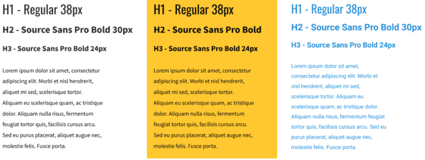
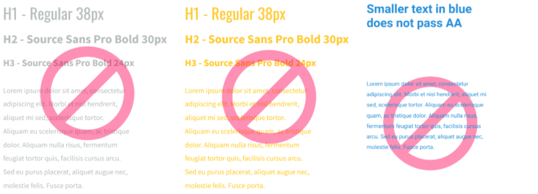

# Color contrast

The chosen colors have been tested and passed WGAC Level 2.0  contrast ratio standards. \
(except yellow and light grey)

### Primary colors

| Kettering Navy                                   | Kettering Yellow                                 | Kettering Blue                                   | Bright Blue                                      |
| ------------------------------------------------ | ------------------------------------------------ | ------------------------------------------------ | ------------------------------------------------ |
|                  |                |                  |              |
|   `#003A7E` |   `#FFCE00` |   `#1851A3` |   `#299AE2` |

### Accent colors

| Engineering                                     | Science & Liberal Arts                          | Management                                      | Graduate Studies                                |
| ----------------------------------------------- | ----------------------------------------------- | ----------------------------------------------- | ----------------------------------------------- |
|               |               |                |                 |
|  `#C04F0F` |  `#77368D` |  `#0A7B45` |  `#0F929A` |

### Neutral colors

| Black                                           | Dark Grey                                       | Medium Grey                                     | Light Grey                                      |
| ----------------------------------------------- | ----------------------------------------------- | ----------------------------------------------- | ----------------------------------------------- |
|                |          |                 |         |
|  `#090909` |  `#4D4D4D` |  `#6F7676` |  `#EDF1F1` |


**Proper text sizes:**\
&#x20;WCAG 2.0 level AA requires a contrast ratio of at least 4.5:1 for normal text and 3:1 for large text. Large text is defined as 14 point (typically 18.66px) and bold or larger, or 18 point (typically 24px) or larger.


Learn more: [https://webaim.org/resources/contrastchecker/](https://webaim.org/resources/contrastchecker/)

###

### Examples of usage

Be sure to follow these guidelines to ensure you are using colors that provide sufficient contrast for visually impaired users. Here are examples of proper and improper usage.

**These examples are safe to use:**

**These examples do not pass and should never be used:**

