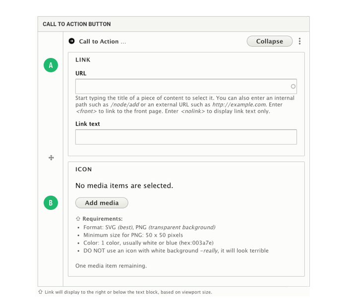

# CTA Banner Component

The CTA Banner is a more visually dynamic component which can be used to emphasize a specific call-to-action. But can also be effective as a visual break between content sections.

### Basic Steps to Add a CTA Banner

1. Add Section: Single Column
2. Under Layout Options:
   1. Set Top Margin = Zero
   2. Set Bottom Margin = Zero
   3. Click Add Section Button
3. In new section, click `Add Block` dropdown, selecting CTA Banner
4. In Modal Form, complete fields:&#x20;
   1. Title&#x20;
   2. Call to Action Text Block
   3. Call to Action Button
   4. Style, Select Color theme
5. Click Save


**Section Level Configuration**\
Always set the Top Margin and Bottom Margin to Zero for starters. The only time when you will change is for sections with background image/video.


### Configuring a CTA Banner

First off, it is important to understand that a content admin can add an inline block CTA Banner which will only be displayed on the page where the block is created. Or can select an existing Global CTA Banner, which makes it easy to reuse more common banners.

.png>)

The title is required, but will never be displayed, so unchecking the Display Title checkbox is not necessary

1. **Title:** The title is required, but will never be displayed, so unchecking the Display Title checkbox is not necessary
2. **Call To Action Text Block:** Add the text which displays next or above the CTA button. Consider using heading tags to make text larger. Color of text is handled by the Color Theme (style) selected and/or Section Background Color
3. **Call to Action Button:** This button/link displays next to or below the text block. See further instructions below.
4. **More Options:** Fields here allow for adding a background image and wrapping the entire banner with a link. The background image will always be bound by the width and height of the block, use the section level background image for fullscreen display.
5. **Select Existing CTA Banner:** There are some more common CTA Banners which are considered 'global', meaning they are the same wherever displayed. If selecting a block here, any text or link info entered above will be ignored.
6. **Styles:** Select one color theme to set the background color.

#### Call to Action Button (3)

1. **Link:** Add the URL for link and Link text which is displayed to the user.
2. **Icon:** Add an optional icon image next to the link text. It is important to maintain the same visual style for all icons added to banners. Color Theme and Section Background Color settings do not effect the icon, so be sure to upload the correct color. SVG is a vector format that will always be sharp, PNG with a transparent background also works.

### Section Level Configuration

Section level background and layout options do alter the block styles as well.


A Section with Max-width set to Fullscreen overrides most of the block level style settings.


To have the CTA Banner stretch across the viewport:

1. Under Layout Options, set Max-width = Fullscreen
2. Under Background Colors, select a background color OR upload a background image or video.
3. If you upload a video, also upload an image for fallback on devices that don't support display of video
4. Now the Color Themes under Style on the block itself will only control the color of the button outline. All other color breaks are automatically assigned based on the Section background color/image.

Using the CTA Banner in full-width may require a bit more testing with combinations of style settings between the section and block.

#### Section Background Options

**Background Colors:** Similar to block level color themes, the background color will also trigger the correct text color. Use `Add Tint Overlay` in combination with background images/videos to provide contrast for text.

**Background Image:** There are no requirements for size, but you may want to use a more narrow crop, it really depends on the image.

**Background Video:** This field will only accepts MP4 format. Video does add to the page load time, so using a short, looping video is probably best.

### Block Level Color Themes

These really apply to a block when NOT in a fullwidth section. Each Color theme will define the background color and text color.

### Using in Columns

Adding a CTA Banner to columns is usually when you want to include a CTA in a sidebar next to longer but related content. The banner content will always be stacked and will expand to fill the column width. Block level color themes will apply as expected.
