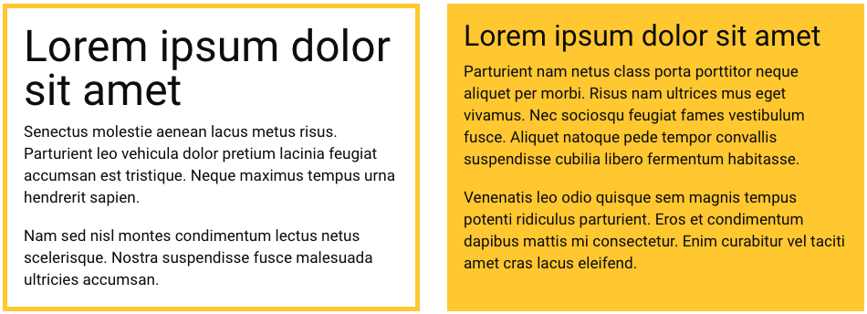
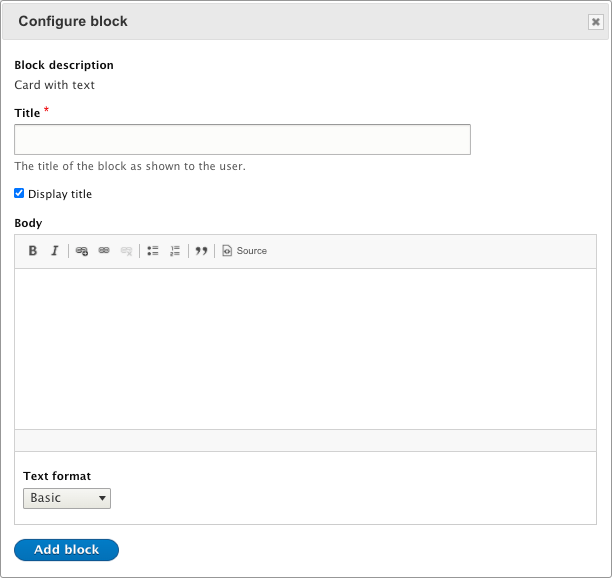
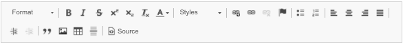
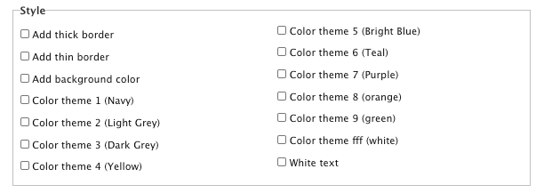

# Card with Text

These blocks are the most basic building blocks of content. They provide a great deal of flexibility in layout, and are often used with sections that have columns. This block also works for longer text, when a card styles is too restrictive.

