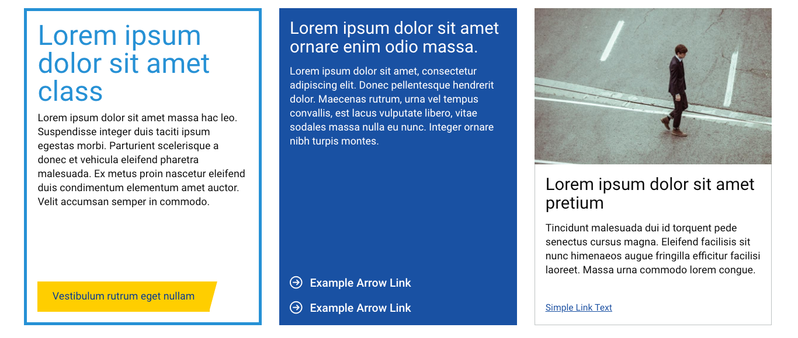
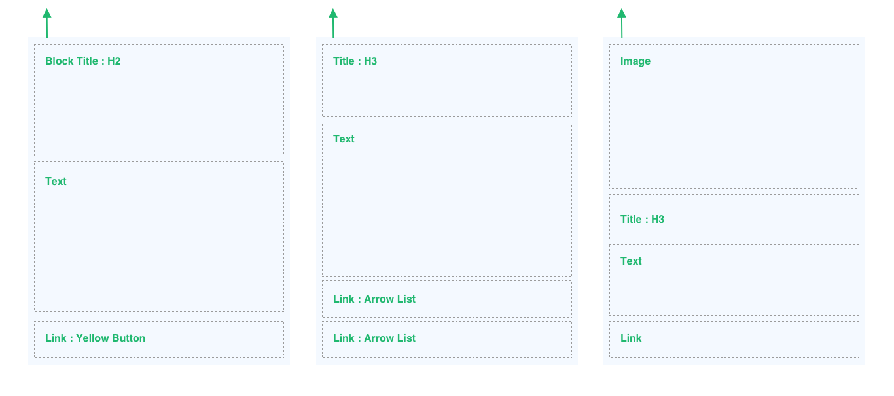
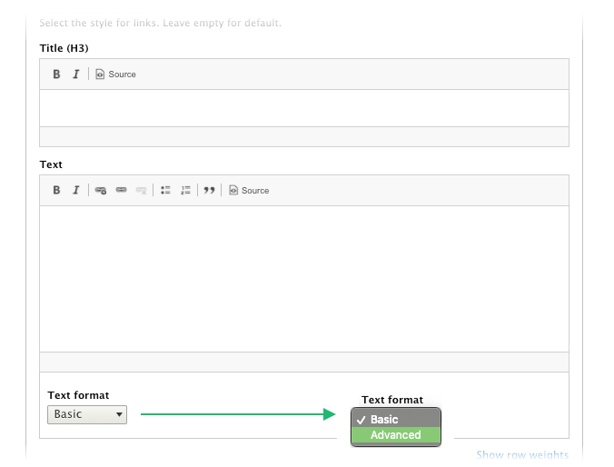
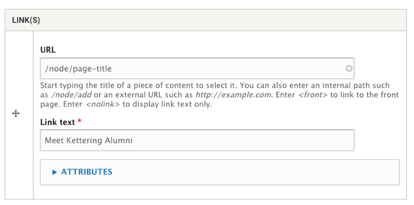
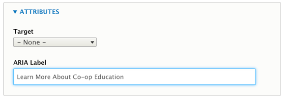
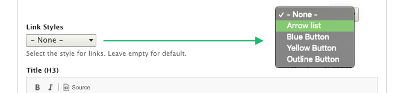
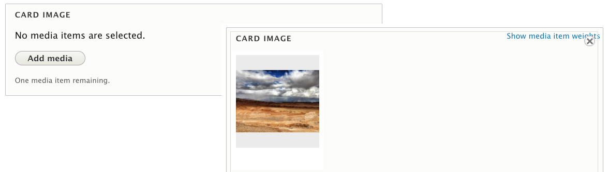

# CTA Block

A component with text, image and a more visual link style. Use this to help site visitors navigate to more key content and actionable steps.

### Block Headings

In most use cases, a block will include a heading at the top. It is important to use the right heading level, and not select it just based on visual style.

The Block title will always display as an H2 (heading level 2), so check the hide title box if this is not the intended use. The Title (H3) field will always be an H3.


Add text about proper use of headings, not skipping heading levels.


## Text Formats

The  color of the Title (H3) field is set by the color style.

Change the Text format to Advanced to use heading tags, and apply color to specific text elements. (see Styling Blocks)

## CTA Links

The link shown at the bottom of blocks is easy to configure.

* **URL internal link:**\
  This is an autocomplete field. To link to an internal link (a page that is part of the site), start typing the page title and you will be shown choices that you can select from. Select the intended page and the link will be added automatically.
* **URL external link:**\
  Enter the full URL (including https://) to link to an external website.
* **Link text:** This is the text that will be displayed in the browser.&#x20;


**Use descriptive link text that is helpful to the reader.**\
****Learn more about this: **** [https://developers.google.com/style/link-text](https://developers.google.com/style/link-text)


\
**Attributes:** Sometimes it is not realistic to include lengthy descriptive link text due to available space in a block. When this happens, you can add the more descriptive text in an `ARIA Label`. For example, if the Link text needs to be something like “Learn More”, then expand the Attributes section and add more descriptive text to the ARIA Label, this is the text that will be read by a screen reader.\


Learn more about ARIA Labels: [https://www.w3.org/TR/WCAG20-TECHS/ARIA14.html](https://www.w3.org/TR/WCAG20-TECHS/ARIA14.html)


## Selecting Link Styles

Select the visual style of the CTA Link(s) using the Link Styles dropdown. The default is a plain blue hyperlink.&#x20;

Note that the Arrow List style will change color based on the background or border color of the block. The CTA Link component is intended to highlight important information for users, but too many on one page can dilute the importance of the links.

## Block Media

The CTA Block wouldn’t be useful without the option to add an image. But be aware of how tall a card can become with an image and lengthy text.

