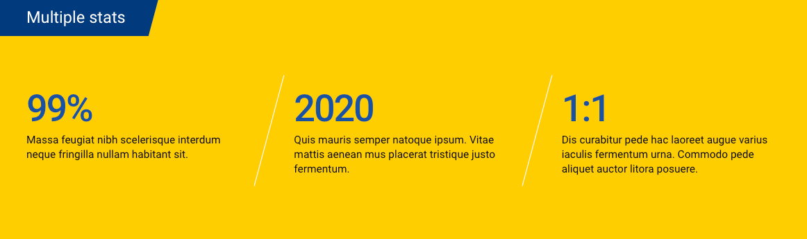

# Stats/Accreditation

Use the Stat component to callout the impressive rankings of the school. This component has several variants to allow for different visual displays, and provides a visual break between page content.

### Replaces these types of statistics on the current website:

### Stat Variations

#### Text Stat

#### Graphic Horizontal

#### Graphic Vertical

### Accreditation

