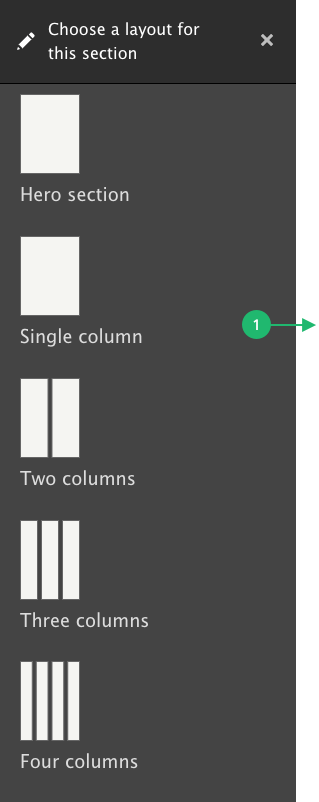

# Sections

Think of a section as a container across the page. As a container, it does not have its own content, but you can put content inside. The section has a number of fields used to describe the layout of the container and its content.

To start, click Add Section - this will expand the the Configuration sidebar from the right side of the browser.

### Adding Sections

When working with an empty layout, the first step is to add a Section. **Sections** are the top-level building blocks of Page Layouts. They’re added by clicking “Add Section”

After clicking “Add Section”, you select a layout for the section. Layout Builder comes with four Section Layouts: One Column, Two Column, Three Column, and Four Column. Additional layouts can be added as needed.

Some Section Layouts have additional configuration options that must be selected before they are added to a Section. For example, for the Two Column, you must choose the column widths before it is added to the Section. (these widths can be changed later as needed)


Be aware that once a section is added, the layout (single, two column, etc.) cannot be changed. But you can always modify the section’s configuration.


|   |   |
| ---------------------------------------------- | ---------------------------------------------- |

#### Section Tray

1. **Choose a layout for this section:** select the layout for your section, after selection, the tray will change to the section configuration.
2. **Administration Label:** Add a label which will be shown only when working on the layout. Setting a label for each section can be helpful in moving blocks from one section to another, and it's always a good idea to be organized.
3. **Section Heading:** The heading text will be displayed at the top of the section with a color ribbon. The heading is always an H2.
4. **Description:** This text will be added to the code of the section, it is a best-practice to add this for screen readers.

|                                                         |                                                   |
| ------------------------------------------------------- | ------------------------------------------------- |
| .png>)  |   |

#### Section configurations for backgrounds and styles

1. **Background Color:** Select a color to fill the background of the section, the default is none or white.
2. **Text Color:** This will force all text in the section to white or black.
3. **Background Image:** Upload a background image which will resize to fit the section.
4. **Background Video:** Upload a mp4 video that will autoplay in the background.
5. **Background Position:** Background images will be centered both vertically and horizontally, but in some cases you may want to adjust based on the image crop.
6. **Max Width:** Control the width of the content within the section.
7. **Column Widths:** Set the percentage of each column in the section.
8. **Top/bottom Margin:** Set the space above and below the section.
9.  **Style:** These options effect the visual style of the section or in some cases the blocks placed within the section.&#x20;

    **Equal height columns:** Forces all blocks in the section to be the same height.

    **Reverse column order on mobile:** Will reverse the order of blocks when displayed on a mobile device, intended to allow an image on right for large screens but move the image on top for mobile.

    **Section without top border:** Removes the default gray border at top of the section when a section has a Section Header.

    **Section header Kettering yellow or bright blue:** Changes the color of the Section Header ribbon from its default Kettering Blue to yellow or bright blue.

Click **Add Section** and the tray will close, and the page will now display the section with buttons to add blocks.

